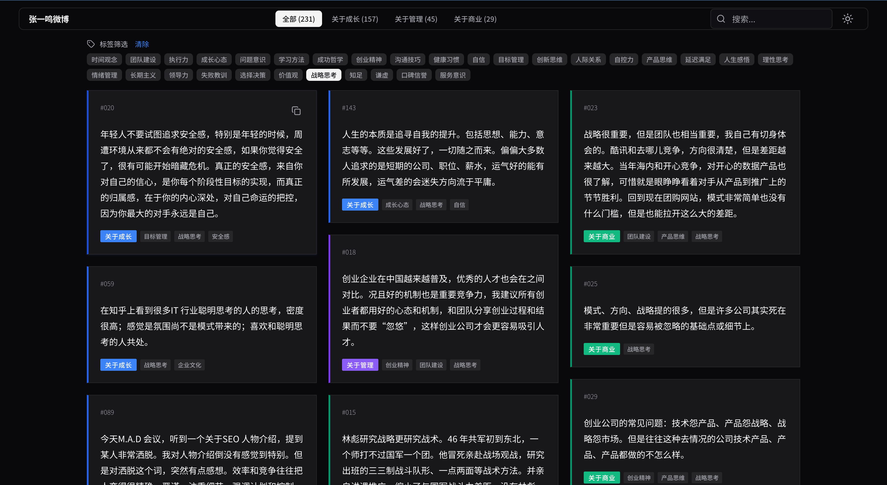

# 张一鸣微博语录可视化

> 231条创业与成长思考 · 交互式知识图谱



## 项目简介

本项目将张一鸣近10年（2010-2020）的231条微博语录进行结构化整理、标签化分类，并以现代化的交互式网页形式呈现。通过瑞士极简主义设计风格，让每一条语录都清晰可读、易于检索。

### 核心功能

- ** 231条精选语录** — 涵盖成长、管理、商业三大主题
- **🏷️ 智能标签系统** — 44个主题标签，100%覆盖所有语录
- **🔍 多维度检索** — 支持按分类、标签、关键词全文搜索
- **🌙 深色模式** — 自动跟随系统偏好，支持手动切换
- **📋 一键复制** — 点击即可复制语录内容
- **📱 响应式设计** — 完美适配手机、平板、桌面端

### 数据概览

| 分类 | 数量 | 占比 |
|------|------|------|
| 关于成长 | 157条 | 68% |
| 关于管理 | 45条 | 19% |
| 关于商业 | 29条 | 13% |

**热门标签：** 时间观念(43)、团队建设(37)、执行力(32)、成长心态(31)、问题意识(30)

## 技术栈

- **框架：** React 18 + TypeScript
- **构建：** Vite 6
- **样式：** Tailwind CSS 3
- **字体：** Noto Sans SC（思源黑体）
- **图标：** Lucide React
- **部署：** GitHub Pages

## 快速开始

### 环境要求

- Node.js 18+
- npm 或 pnpm

### 安装

```bash
git clone https://github.com/YOUR_USERNAME/zhangyiming-visualize.git
cd zhangyiming-visualize
npm install
```

### 开发

```bash
npm run dev
```

访问 http://localhost:5173 查看效果。

### 构建

```bash
npm run build
```

构建产物输出到 `dist/` 目录。

### 预览

```bash
npm run preview
```

## 项目结构

```
zhangyiming-visualize/
├── .github/workflows/     # GitHub Actions 部署配置
├── data/                  # 数据源
│   ├── raw/               # 原始PDF和文本
│   ├── scripts/           # 数据处理脚本
│   ├── *.jsonl            # 结构化数据
├── public/                # 静态资源
├── src/
│   ├── components/        # React组件
│   ├── hooks/             # 自定义Hooks
│   ├── types/             # TypeScript类型定义
│   ├── utils/             # 工具函数
│   └── index.css          # 全局样式
├── assets/                # 图片资源
├── docs/                  # 项目文档
├── package.json
├── vite.config.ts
├── tailwind.config.ts
└── tsconfig.json
```

## 数据处理

语录数据经过以下流程处理：

1. **原始采集** — 从PDF文档提取文本
2. **结构化** — 分类为成长/管理/商业三大板块
3. **标签化** — 基于44个主题标签的关键词匹配系统
4. **验证** — 100%标签覆盖率，90%关键词覆盖率

运行标签生成脚本：

```bash
python3 data/scripts/generate_tags.py
```

## 部署

本项目配置了 GitHub Actions 自动部署：

1. 推送代码到 `master` 分支
2. GitHub Actions 自动构建并部署到 GitHub Pages
3. 访问 `https://YOUR_USERNAME.github.io/zhangyiming-visualize/`

手动部署：

```bash
npm run build
# 将 dist/ 目录部署到任意静态托管服务
```

## 设计理念

采用**瑞士现代主义 2.0**设计风格：

- **严格网格系统** — 数学化间距，清晰层级
- **高对比度** — 黑白为主，单色点缀
- **无装饰** — 去除阴影、圆角等视觉噪音
- **浮动导航** — 胶囊式导航栏，backdrop-blur 效果
- **微交互** — 200ms 平滑过渡，hover 状态反馈

## 许可证

MIT License

## 致谢

- 语录来源：张一鸣公开微博（2010-2020）
- 设计灵感：Swiss Style / International Typographic Style
- 字体支持：Google Fonts - Noto Sans SC
