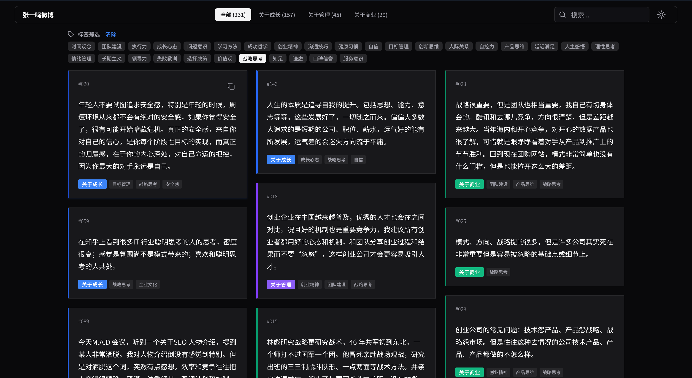

# 张一鸣公开微博语录 · 主题探索

基于整理后的公开语录构建的交互式主题探索页面。支持全文搜索、分类与标签筛选、分类分布图、主题标签排行、标签共现分析及原文阅读。



## 语料与解释边界

仓库附带 `data/raw/` 中的整理文档，以及 `data/zhangyiming_weibo_tagged.jsonl`（部署时使用的副本位于 `public/`）。README 先前记录的语料规模为 231 条；页面现在从实际加载的数据计算总数、分类及标签数量，不以历史统计代替实时结果。

**注意：** 当前 JSONL 记录没有逐条发布日期和可验证的原始微博 URL。因此不提供按年数量、观点演变或引文原始出处的推断式可视化。文本来自整理资料，不应被视为对全部历史发言的完整采样；主题标签是生成式标注结果，共现仅表示在本数据集内同一记录出现，不代表观点之间存在因果关系。

## 功能

- 全文搜索：匹配正文、标签及关键词，和分类/标签筛选共同生效。
- 互动分类分布：基于当前搜索范围统计各分类，点击柱形图筛选。
- 主题排行：按当前搜索及分类范围统计每个标签覆盖的语录数；一个语录可拥有多个标签，所以各标签占比之和不一定是 100%。
- 关联主题：选中一个标签后，展示当前匹配记录中与它共同出现的其他标签；点击关联标签可切换探索对象。
- 原文卡片：保留深色模式、复制和响应式阅读布局；提供键盘焦点及文字统计作为图表的非视觉替代。
- 数据校验：拒绝无效记录或重复全局 ID，展示具体行号，避免静默漏掉语录后仍展示错误的统计。

## 技术栈

React 18、TypeScript、Vite 6、Tailwind CSS 3 和 Lucide React。可视化采用轻量化 HTML/CSS 统计条及原生按钮，没有新引入图表运行时依赖。

## 本地开发

需要 Node.js 20 和 Python 3.11（Python 仅用于数据校验与对应回归测试）。

```bash
git clone https://github.com/1998x-stack/zhangyiming-visualize.git
cd zhangyiming-visualize
npm ci
npm run dev
```

构建和检查：

```bash
python3 data/scripts/validate_data.py
python3 -m unittest discover -s tests -p 'test_*.py' -v
npm test
npm run build
npm run preview
```

`npm test` 使用 Node.js 内置测试运行器检查数据聚合和客户端 JSONL 解析；`npm run build` 执行 TypeScript 类型检查并生成 `dist/`。数据校验脚本检查必需字段、编号唯一性及 `data/` 与 `public/` 语料副本一致性。

## 代码结构

- `src/components/InsightsDashboard.tsx`：交互式统计与主题关联视图。
- `src/utils/insights.ts`：与 React 分离的分类/标签聚合逻辑。
- `src/hooks/useFilter.ts`：所有可视化与列表共用的筛选规则。
- `src/utils/parseJsonl.ts`：客户端运行时结构校验和错误定位。
- `tests/insights.test.cjs`：数据聚合及客户端解析的前端回归测试。
- `data/scripts/validate_data.py`、`tests/test_data.py`：独立于前端的数据检查与回归测试。
- `.github/workflows/ci.yml`：对 PR 和主分支执行数据校验、测试及生产构建。
- `.github/workflows/deploy.yml`：`main` 分支通过验证及构建后发布 GitHub Pages。

## 原始数据与标签生成

原始整理资料位于 `data/raw/`。`data/scripts/generate_tags.py` 依赖外部 DashScope SDK 与相应 API 访问权限，且当前脚本使用相对工作目录路径；它不是运行网站或执行本仓库测试的必需步骤。人工检查生成的标签后，应同步更新 `data/` 和 `public/` 中的 JSONL 副本，并运行上述校验。

## 后续扩展

只有在为每条记录补齐**经核实**的发表日期、原始来源和明确的数据缺失标记后，才适合添加时间趋势与原始出处跳转。大型语料可再考虑虚拟列表和专用图表库。
